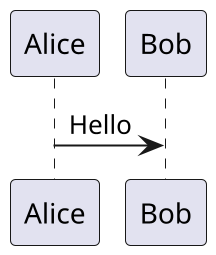
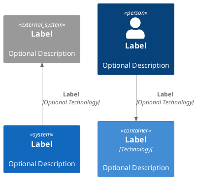

# Demo presentation

This is the title slide

---

## First slide with contents

- Item 1
- Item 2

---

## PlantUML Diagram example

Below is a standard PlantUML sequence diagram:

---

## PlantUML C4 diagram

